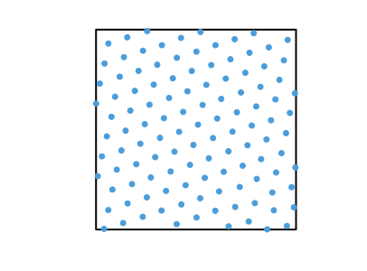
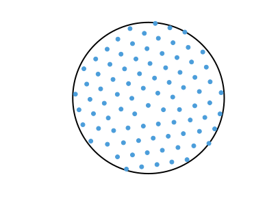
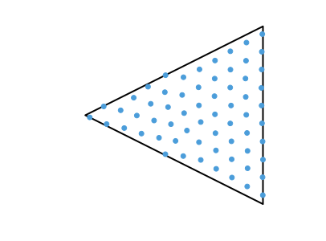
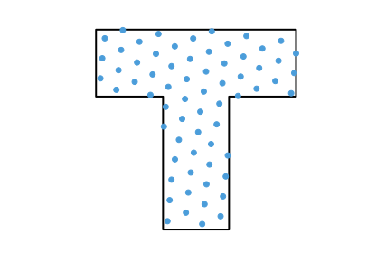

# symbolsampler

This repository contains code to simulate dense packing of circular particles in four different environments. 
It was used to generate some of the figures in `Nicolai Waniek (2018). Hexagonal Grid Fields Optimally Encode Transitions in Spatiotemporal Sequences. Neural Computation, , 1-35`.

Please cite the article if you reuse or extend the code for your purposes.

```
@article{Waniek2018_NECO,
  doi       = {10.1162/neco_a_01122},
  url       = {https://doi.org/10.1162/neco_a_01122},
  year      = {2018},
  month     = {oct},
  publisher = {{MIT} Press - Journals},
  volume    = {30},
  number    = {10},
  pages     = {2691--2725},
  author    = {Nicolai Waniek},
  title     = {Hexagonal Grid Fields Optimally Encode Transitions in Spatiotemporal Sequences},
  journal   = {Neural Computation}
}
```


## Examples

### Square Maze, End of Simulation


### Circular Maze, End of Simulation


### Triangular Maze, End of Simulation


### T-Maze, End of Simulation

